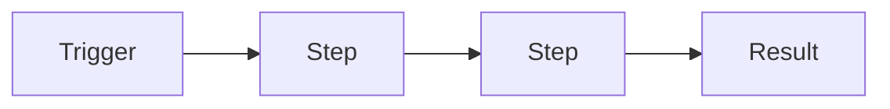

# [Workflow Name]

One or two sentences: what it does and who it's for.

## What it does

- …

## What it never does

- …

## How it works

## Quick start

1. …
2. …
3. Import `workflow/[name].json` into n8n.
4. Connect credentials.
5. Test with the manual trigger, then **Publish**.

**Full guide: [SETUP.md](SETUP.md)**

## Files

| Path | What it is |
|---|---|
| `workflow/[name].json` | Main workflow |
| `config/` | Templates, if any |
| `SETUP.md` | Complete setup guide |
| `CHANGELOG.md` | Version history |

## Requirements

| | |
|---|---|
| n8n | 2.x |
| Accounts | … |
| Credentials | … |

## Known limits

- …
