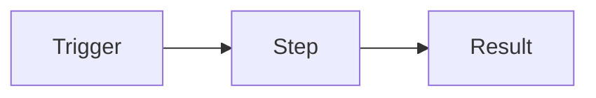

# [Workflow Name] — Setup Guide

What it does in two sentences, and roughly how long setup takes.

> **Placeholders:** `https://n8n.snova.com` = your n8n address, `you@example.com` = your email.

## How it works

## Before you start

| You need | Cost | Where |
|---|---|---|
| n8n 2.x | Free (self-hosted) | Part 1 |
| … | … | … |

## Part 1: …

1. Exact click path → **Button** → **Button**.
2. …

✅ **You should now see:** …

## Part 2: Import the workflow

1. In n8n: new workflow → **⋯ → Import from File…** → `workflow/[name].json`.

## Part 3: Credentials

| Node | Credential |
|---|---|
| … | … |

## Part 4: Test

| Do this | Expected result |
|---|---|
| … | … |

## Part 5: Go live

Save → **Publish**. Monitor in **Executions**.

## Customizing

…

## Troubleshooting

| Symptom | Cause | Fix |
|---|---|---|
| … | … | … |

## Final checklist

- [ ] …
