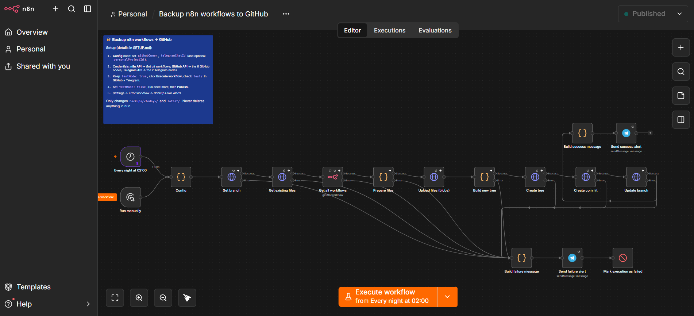
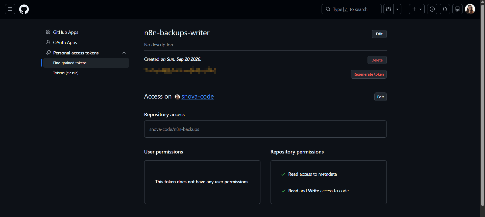
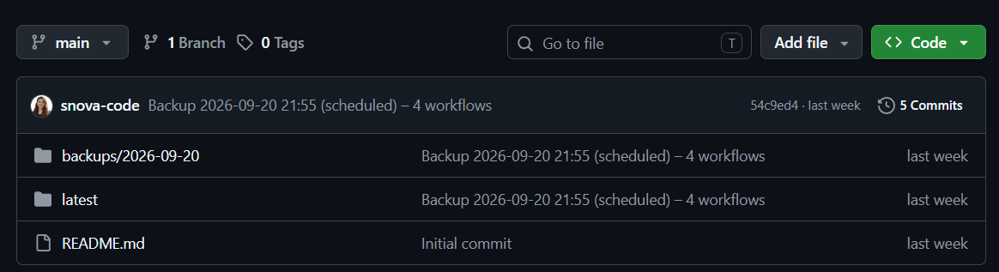
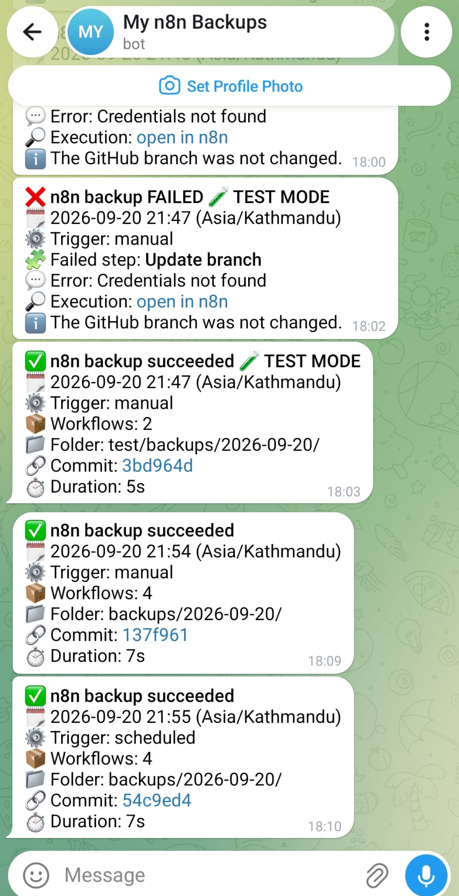
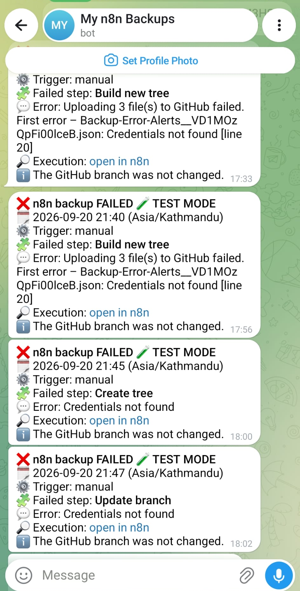
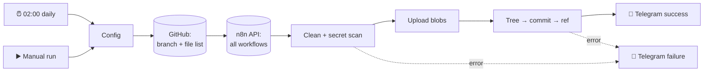

# Nightly n8n → GitHub Backup

Backs up **all your n8n workflows to a private GitHub repo every night**, as a single commit, with dated snapshots and a `latest/` folder for restoring. Scans for secrets before it uploads, and sends a Telegram message on every run, success or failure.

 

 

 

 

## What it does

- **One commit per run.** The GitHub node writes one file per call, which would mean one commit per workflow. This uses GitHub's Git Data API instead: blobs → tree → commit → update ref.
- **Dated snapshots.** `backups/YYYY-MM-DD/<name>__<id>.json` plus a `_manifest.json` index listing id, name, published state, archived flag, tags and timestamps.
- **A `latest/` folder** that always mirrors the newest snapshot, so a restore never has to work out which date to use.
- **Replaces, never duplicates.** A second run on the same day rewrites that day's folder, including removing files for workflows you deleted.
- **Stops on secrets.** Pinned data and static data are stripped, and every node is scanned for token-shaped strings. A match halts the run and names the workflow and node on Telegram, without printing the value.
- **Tells you either way.** Success: date, trigger type, workflow count, commit link, duration. Failure: which step broke, the error, and a link to the failed execution. A separate error workflow covers crashes the main one can't report.
- **Test mode.** Back up 2 workflows into a `test/` prefix before going live.

## What it never does

It never deletes, changes or publishes anything in n8n; it only reads. In GitHub it may only touch today's snapshot folder and `latest/`, enforced in code: every path in the outgoing commit is checked and anything else throws before a byte leaves.

## How it works

Nothing in the repo changes until the final `PATCH .../git/refs/heads/main`. Any earlier failure leaves it untouched.

## Quick start

1. Create a **private** repo called `n8n-backups` **with a README** (an empty repo has no branch to commit to).
2. Create a **fine-grained GitHub token**: that one repo, **Contents: Read and write**.
3. Create a **Telegram bot** with @BotFather, press **Start**, and get your chat ID from `getUpdates`.
4. In n8n: **Settings → n8n API → Create an API key**, then add the **n8n API**, **GitHub API** and **Telegram API** credentials.
5. Import both files from `workflow/`, fill in the **Config** node, select credentials on all 9 nodes.
6. Run with `testMode: true`, check the `test/` folder and the Telegram message, then set it to `false` and **Publish**.

**Full step-by-step guide with ✅ checkpoints: [SETUP.md](SETUP.md)** (about 30 minutes the first time).

## Files

| Path | What it is |
|---|---|
| `workflow/backup-n8n-to-github.json` | Main workflow (18 nodes) |
| `workflow/backup-error-alerts.json` | Error workflow: Telegram alert on a crash |
| `SETUP.md` | Complete setup guide, including a restore script and practice restore |
| `CHANGELOG.md` | Version history |
| `images/` | Screenshots for the guide |

## Requirements

| | |
|---|---|
| n8n | 2.x (self-hosted or Cloud), public API enabled |
| Accounts | GitHub, Telegram |
| Credentials | n8n API, GitHub API (fine-grained token), Telegram API |
| Volume | Fine for dozens of workflows. Uploads are paced 1/second to stay under GitHub's limit of ~80 content requests per minute |

## Safety

| Rule | How it's enforced |
|---|---|
| Never touches n8n | Read-only API calls; the key only needs `workflow:list` and `workflow:read` |
| Only today's folder and `latest/` | Every tree path checked against those two prefixes; anything else throws |
| Never empties `latest/` | Stops if the API returns 0 workflows, or if the count drops more than 50% |
| No secrets pushed | Pinned and static data stripped; pattern scan halts the run on a match |
| Token can't reach other repos | Fine-grained token scoped to one repo, Contents only |

## Known limits

- **Missed runs are not caught up.** If n8n is down at 02:00, that night is skipped. The absence of a Telegram message is the alert.
- **Publish after every change.** In n8n 2.x, scheduled runs use the published version; a manual run uses the draft.
- **The secret scan is pattern-based.** It catches token shapes, not arbitrary passwords like `"password": "hunter2"`. Keep secrets in Credentials.
- **No folder in the manifest.** The n8n public API does not return which folder a workflow is in, so `folder` is always `null`.
- **Snapshots are never pruned automatically.** That's deliberate; SETUP.md shows the manual clean-up.

## Write-up

The story behind the build, including the first run that failed: [Medium article link]