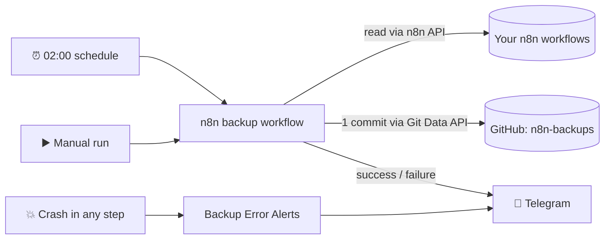
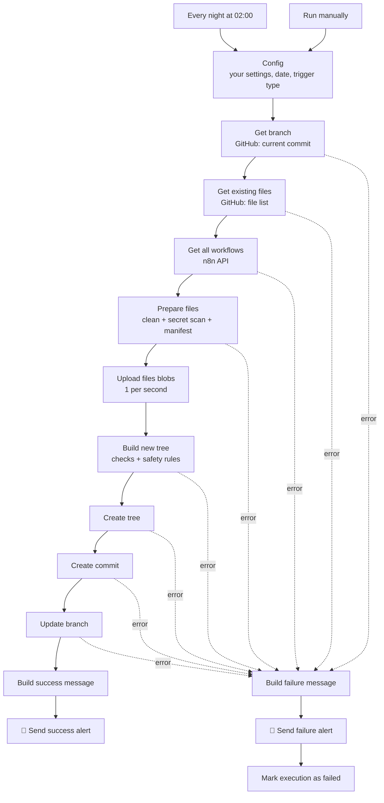
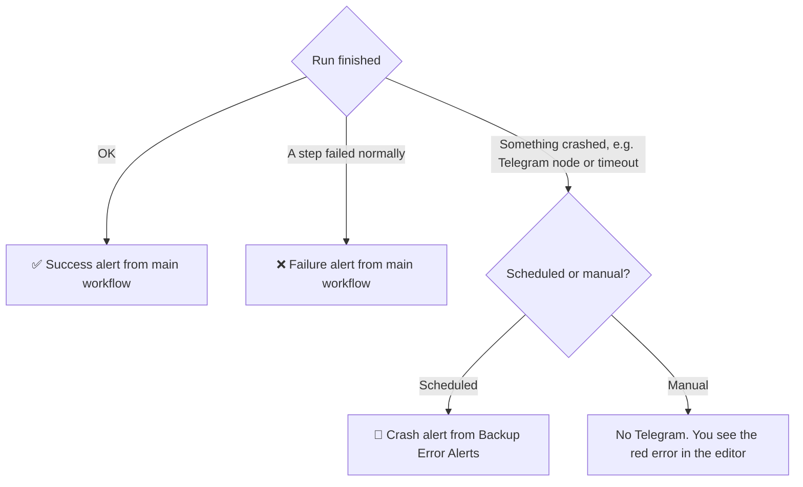

# Nightly n8n → GitHub Backup — Complete Setup Guide

**Files in this folder**

| File | What it is |
|---|---|
| `workflow/backup-n8n-to-github.json` | The main backup workflow (18 nodes) |
| `workflow/backup-error-alerts.json` | Error workflow: a Telegram alert if something crashes |
| `SETUP.md` | This guide |
| `CHANGELOG.md` | Version history |

Built and checked against **n8n 2.39.8** (the exact release tag in the `n8n-io/n8n` repo).

---

> **Placeholders used in this guide.** `https://n8n.snova.com` stands for *your* n8n address, `n8n-backups` for *your* private backup repo, and `YOUR_GITHUB_USERNAME` / `YOUR_TELEGRAM_CHAT_ID` for your own values.

## Contents

1. [What it does](#what-it-does)
2. [Are secrets ever exported?](#are-secrets-ever-exported)
3. [Before you start](#before-you-start)
4. [Part 1: Create the private GitHub repo](#part-1-create-the-private-github-repo)
5. [Part 2: Create the fine-grained GitHub token](#part-2-create-the-fine-grained-github-token)
6. [Part 3: Create the Telegram bot and find your chat ID](#part-3-create-the-telegram-bot-and-find-your-chat-id)
7. [Part 4: Create the n8n API key and credentials](#part-4-create-the-n8n-api-key-and-credentials)
8. [Part 5: Import the workflows](#part-5-import-the-workflows)
9. [Part 6: Test safely (test mode)](#part-6-test-safely-test-mode)
10. [Part 7: Go live](#part-7-go-live)
11. [Restore](#restore)
12. [Troubleshooting](#troubleshooting)
13. [Final checklist](#final-checklist)

## What it does

Every night at **02:00 Asia/Kathmandu**, or whenever you click **Execute workflow**, it does the following:

1. Reads all **your** workflows from `https://n8n.snova.com` through the n8n API.
2. Cleans each one: removes pinned test data and static data, and scans for secrets typed directly into nodes.
3. Uploads everything to your private repo `n8n-backups` as **one single commit**:

```
n8n-backups/
├── README.md
├── backups/
│   ├── 2026-09-20/
│   │   ├── _manifest.json
│   │   ├── Invoice-Mailer__aB3dE9fG.json
│   │   └── Daily-Report__Xy12Kq7w.json
│   └── 2026-09-21/ ...
└── latest/                 ← always identical to the newest day's folder
    ├── _manifest.json
    ├── Invoice-Mailer__aB3dE9fG.json
    └── Daily-Report__Xy12Kq7w.json
```

4. Sends a Telegram message on **every** run, whether it succeeded or failed.

**It does not:**
- Back up credentials or data tables. Credential *secrets* can't be exported through the API anyway.
- Delete, change or publish anything in n8n. It only *reads* your workflows.
- Touch anything in GitHub except **today's folder** and **`latest/`**. A built-in safety check stops the run if it ever tries to.
- Delete old snapshots. They are kept forever until you clean them up yourself (see Change the schedule and manage old snapshots).

**Assumptions**
- If you are a **Member** rather than the owner of your n8n instance, the API key only sees workflows you own, plus any shared with you. Owners and admins see everything on the instance.
- Your n8n instance is always on, so no catch-up logic is included (see Troubleshooting if it was down at 02:00).
- The repo is owned by your **personal** GitHub account and its branch is `main`.
- File names use only `A–Z a–z 0–9 . _ -`. Names written entirely in Nepali or another non-Latin script become `workflow` or `untitled`. The workflow ID in every file name keeps each file unique and easy to find.

### Overall flow



### Node-by-node flow



Nothing in GitHub changes until the very last GitHub step, **Update branch**. If any earlier step fails, your repo stays exactly as it was.

### Which alert do you get?



When the main workflow has already sent a ❌ alert, the Error Workflow deliberately stays quiet, so you never get two messages for the same failure.

---

## Are secrets ever exported?

| What | In the backup? | Why |
|---|---|---|
| Credential secrets (API keys, passwords, OAuth tokens saved in **Credentials**) | ❌ Never | Workflows only store a reference such as `"githubApi": {"id": "…", "name": "GitHub account"}`. The secrets are stored encrypted separately, and the workflow API never returns them. |
| Pinned test data | ❌ Removed | Requested with `excludePinnedData` **and** forced to `{}` in the file |
| Static data (the workflow's internal memory) | ❌ Removed | Dropped in *Prepare files* |
| Values you **typed directly** into a node (e.g. an API key pasted into an HTTP Request header or a Code node) | ⚠️ Would be exported, so the **secret scan stops the run** | See below |

**Secret scan.** Before anything is uploaded, every node is checked for things that look like: GitHub tokens, OpenAI/Anthropic-style keys, Stripe live keys, AWS access keys, Google API keys, Slack tokens, Telegram bot tokens, private keys, hard-coded `Bearer …` tokens and JWTs.

If one is found, the run stops, **nothing is uploaded**, and Telegram tells you the workflow and node names. The secret itself is never shown. To fix it, move the value into an n8n credential and run again.

**Limits, so you know:** the scan works on patterns. It can't recognise a plain password like `"password": "hunter2"`. The rule of thumb is to never type secrets into node fields and always use Credentials.

---

## Before you start

| Item | Cost | Notes |
|---|---|---|
| GitHub account | Free | Private repos are free |
| An n8n 2.x instance you can reach | Free | Self-hosted or Cloud. You need the **n8n API** menu under Settings |
| Telegram account (phone app) | Free | You'll create a bot in step 6 |
| About 30 minutes | | |

Rate limits (all well within free limits for about 34 workflows):
- **GitHub:** at most 80 "create content" requests per minute and 500 per hour. Each run uses about one request per workflow plus 3. The upload node is paced at 1 per second, which stays safely under the per-minute limit. Avoid more than about 10 manual runs in one hour.
- **Telegram:** 1 message per run, so no concern.

---

## Part 1: Create the private GitHub repo

1. Log in to **github.com** and click **+** (top right) → **New repository**.
2. Fill in:
   - **Owner:** your username
   - **Repository name:** `n8n-backups`
   - **Visibility:** **Private**
   - **Add README:** turn it **On**. ⚠️ This matters: the workflow needs the `main` branch to already exist, and an empty repo has no branch.
3. Click **Create repository**.

✅ **You should now see** a repo page showing a 🔒 **Private** badge and one file, `README.md`, on branch `main`.

## Part 2: Create the fine-grained GitHub token

1. Click your profile photo (top right) → **Settings**.
2. In the left sidebar, scroll to the bottom → **Developer settings**.
3. **Personal access tokens** → **Fine-grained tokens** → **Generate new token**.
4. Fill in:
   - **Token name:** `n8n-backups-writer`
   - **Expiration:** choose the longest you're comfortable with (e.g. 1 year) and put a calendar reminder to renew it.
   - **Resource owner:** your account
   - **Repository access:** **Only select repositories** → pick **n8n-backups**
   - **Permissions → Repository permissions:** find **Contents** and set it to **Read and write**. GitHub automatically adds **Metadata: Read-only**, which is required and fine. Leave everything else at **No access**. (On newer GitHub pages you click **Add permissions** and tick **Contents**, then set it to **Read and write**.)
5. Click **Generate token**, then **copy the token now**. GitHub shows it only once. It starts with `github_pat_`.

✅ **You should now see** the token in your list with "1 repository" and "Contents: read and write".

## Part 3: Create the Telegram bot and find your chat ID

**Create the bot**
1. In Telegram, search for **@BotFather** (it has a blue tick) and open it → **Start**.
2. Send `/newbot`.
3. When asked for a name, send e.g. `My n8n Backups`.
4. When asked for a username, send a unique one ending in `bot`, e.g. `my_n8n_backup_bot`.
5. BotFather replies with a **token** like `8123456789:AAH…`. Copy it.

**Find your chat ID**
1. Tap the link BotFather gave you (`t.me/your_bot_name`) → press **Start**, then send any message such as `hi`. ⚠️ If you skip this step, the bot isn't allowed to message you.
2. In a browser, open (replace `<TOKEN>` with your token):
   `https://api.telegram.org/bot<TOKEN>/getUpdates`
3. Find `"chat":{"id":123456789,...`. That number is your **chat ID**.

✅ **You should now see** a JSON page containing your `hi` message and your chat ID. If it shows `"result":[]`, send the bot another message and refresh the page.

## Part 4: Create the n8n API key and credentials

**4a. API key**
1. Open `https://n8n.snova.com` → bottom-left **Settings** → **n8n API**.
2. Click **Create an API key**.
3. **Label:** `github-backup`. **Expiration:** pick one and set a reminder, or "No expiration".
4. If you see a **Scopes** section, select only **workflow:list** and **workflow:read**. (Scopes are a paid feature. On the free edition the section is hidden, and the key gets all normal Member permissions. The workflow still only ever *reads*.)
5. Click **Save** and **copy the key** (it's shown once).

**4b. Credentials** (create all three)

In n8n, go to **Overview** (left sidebar) → the dropdown next to **Create workflow** → **Create credential**, then search for each type:

| Credential type | Field | Value |
|---|---|---|
| **n8n API** | API Key | the key from step 4a |
| | Base URL | `https://n8n.snova.com/api/v1` ← must end in `/api/v1` |
| **GitHub API** | GitHub Server | `https://api.github.com` (default) |
| | User | your GitHub username |
| | Access Token | the `github_pat_…` token from step 5 |
| **Telegram API** | Access Token | the bot token from step 6 |
| | Base URL | leave the default `https://api.telegram.org` |

Click **Save** on each one. ✅ **You should now see** a green "Connection tested successfully" message for n8n API and Telegram API. GitHub may not show a test; that's fine.

## Part 5: Import the workflows

**5a. Error workflow first**
1. **Overview** → **Create workflow**.
2. Top-right **⋯** menu → **Import from File…** → choose `workflow/backup-error-alerts.json`.
3. Open **Build crash message** and replace `YOUR_TELEGRAM_CHAT_ID` with your chat ID. Keep the quotes: `'123456789'`.
4. Open **Send crash alert** → **Credential** → select your Telegram credential.
5. Click **Save**. ✅ It does **not** need to be published.

**5b. Main workflow**
1. **Overview** → **Create workflow** → **⋯** → **Import from File…** → `workflow/backup-n8n-to-github.json`.
2. Open the **Config** node and edit the top block:

| Setting | Set to |
|---|---|
| `testMode` | leave `true` for now |
| `githubOwner` | your GitHub username, e.g. `'snova-code'` |
| `githubRepo` | `'n8n-backups'` |
| `githubBranch` | `'main'` |
| `n8nBaseUrl` | already set to `'https://n8n.snova.com'` |
| `telegramChatId` | your chat ID, e.g. `'123456789'` |
| `personalProjectId` | optional, leave `''` (see section 13) |

3. Select credentials. These can't be pre-filled:

| Node | Credential |
|---|---|
| Get all workflows | **n8n API** |
| Get branch | **GitHub API** (field **Credential for GitHub API**) |
| Get existing files | GitHub API |
| Upload files (blobs) | GitHub API |
| Create tree | GitHub API |
| Create commit | GitHub API |
| Update branch | GitHub API |
| Send success alert | **Telegram API** |
| Send failure alert | Telegram API |

4. Click **Save**.

✅ **You should now see** no red warning triangles on any node.

---

## Part 6: Test safely (test mode)

Test mode backs up only the **first 2 workflows** (alphabetical) into a separate `test/` folder, so the real `backups/` and `latest/` folders are never touched.

**Test 1: normal run**
1. With `testMode: true`, click **Execute workflow**.
2. The run takes about 10–20 seconds.

✅ **You should now see:**
- In n8n, every node on the top row is green, ending with **Send success alert**.
- In Telegram:
  ```
  ✅ n8n backup succeeded 🧪 TEST MODE
  🗓 2026-09-20 14:05 (Asia/Kathmandu)
  ⚙️ Trigger: manual
  📦 Workflows: 2
  📁 Folder: test/backups/2026-09-20/
  🔗 Commit: a1b2c3d
  ⏱ Duration: 14s
  ```
- In GitHub, one new commit titled `[TEST] Backup 2026-09-20 14:05 (manual) – 2 workflows`, containing `test/backups/2026-09-20/` (2 workflow files + `_manifest.json`) and `test/latest/` (the same 3 files).
- Open one workflow file: `"pinData": {}`, no `staticData`, and credentials appear only as `{ "id": ..., "name": ... }`.
- Open `_manifest.json` and check that `isArchived` and `tags` look right.

**Test 2: same-day rerun (no duplicates)**
Click **Execute workflow** again. ✅ There's a second commit, but the `test/backups/<today>/` folder still has exactly 3 files.

**Test 3: failure alert**
1. In **Config**, temporarily change `githubRepo` to `'n8n-backups-typo'` and run.
2. ✅ Telegram shows `❌ n8n backup FAILED` · Failed step: **Get branch** · Error: `404 … Not Found` · plus an "open in n8n" link.
3. Change it back to `'n8n-backups'`.

**Test 4: secret scan (optional)**
1. Create a scratch workflow named `!!! secret-scan-test`. The `!!!` makes it sort first, so test mode picks it up.
2. Add an **Edit Fields (Set)** node with a string field whose value is `Bearer abcdefghijklmnopqrstuvwxyz123456`, then save.
3. Run the backup. ✅ Telegram shows: Failed step: **Prepare files** · `Secret scan stopped the backup … "!!! secret-scan-test" › node "Edit Fields" (Hard-coded Bearer token)`.
4. Delete the scratch workflow yourself (the backup never deletes anything in n8n).

**Test 5: crash alert from the Error Workflow (optional)**
Error Workflows only run for **automatic** executions, so they can't be tested with a manual run.
1. Create a scratch workflow: **Schedule Trigger** (every 1 minute) → **Code** node with `throw new Error('crash test');`.
2. Open its **⋯ → Settings** → **Error workflow** → **Backup Error Alerts** → **Save**. Then **Publish** it.
3. Within a minute, ✅ Telegram shows `🚨 Workflow crashed … crash test`.
4. **Unpublish** and delete the scratch workflow.

**Clean up the test folder** (optional; it's harmless if you leave it). In a terminal:
```bash
git clone https://github.com/<you>/n8n-backups.git && cd n8n-backups
git rm -r test && git commit -m "Remove test backups" && git push
```

---

## Part 7: Go live

1. In **Config**, set `testMode: false` → **Save**.
2. Click **Execute workflow** once. ✅ You get a full backup in `backups/<today>/` and `latest/`, and Telegram shows the real workflow count.
3. **⋯ → Settings** → **Error workflow** → select **Backup Error Alerts** → **Save**.
4. Click **Publish** (top right).

   ⚠️ **In n8n 2.x, scheduled runs use the *published* version.** Every time you change something later (Config, schedule time, …), click **Publish** again, or the 02:00 run keeps using the old settings.

✅ **You should now see** the workflow marked as published in the Overview list.

**Monitoring**
- **Telegram:** you get a message after every run. **No message at about 02:01 means something is wrong.** Check that the server is up and that the workflow is still published.
- **n8n:** **Overview → Executions** (or the workflow's **Executions** tab) lists every run. Failed runs are red because of *Mark execution as failed*.
- **GitHub:** the **Commits** page should show one commit per night.

---

## Restore

Each backup file contains the full workflow: `name`, `nodes`, `connections` and `settings`. **Restoring always creates a new copy.** Nothing is overwritten.

After restoring, keep in mind:
- **Credentials:** on the *same* server, nodes reconnect to your existing credentials automatically because the IDs match. On a *new* server, open each node and select the credential again.
- **Tags** aren't restored; add them again by hand if you need them.
- **Webhook workflows:** if the original is still published, don't publish the copy, because both would try to use the same webhook URL.
- Restored copies start **unpublished**, which is safe.

### Restore A: Restore one workflow (browser only)
1. On GitHub, open `latest/` (or `backups/<date>/` for an older version) → click the file → **Download raw file** (⬇ icon).
2. In n8n: **Overview → Create workflow → ⋯ → Import from File…** → choose the file.
3. Rename it if you want, e.g. add "(restored)", check the credentials, then **Save**.

### Restore B: Restore everything from `latest/` (script)

This script only **creates** workflows through the n8n API. It never updates or deletes anything. It runs as a **dry run** unless you add `--go`. You need Node.js 18 or newer.

Save this as `restore-latest.mjs` inside your cloned repo folder:

```js
// restore-latest.mjs — creates NEW copies of workflows from a backup folder.
// It never updates or deletes existing workflows. Dry run by default.
// Usage:
//   N8N_URL=https://n8n.snova.com N8N_API_KEY=xxxx node restore-latest.mjs latest
//   ... add --go to really create them, --only <file.json> for one file, --no-suffix to keep original names
import fs from 'node:fs';
import path from 'node:path';

const [dir = 'latest', ...flags] = process.argv.slice(2);
const GO = flags.includes('--go');
const ONLY = flags.includes('--only') ? flags[flags.indexOf('--only') + 1] : null;
const SUFFIX = flags.includes('--no-suffix') ? '' : ` (restored ${new Date().toISOString().slice(0, 10)})`;
const BASE = (process.env.N8N_URL || '').replace(/\/+$/, '');
const KEY = process.env.N8N_API_KEY;
if (!BASE || !KEY) { console.error('Set N8N_URL and N8N_API_KEY first.'); process.exit(1); }

// Only fields the n8n public API accepts when creating a workflow (checked against n8n 2.39.8).
const NODE_KEYS = ['id', 'name', 'webhookId', 'disabled', 'notesInFlow', 'notes', 'type', 'typeVersion', 'executeOnce',
  'alwaysOutputData', 'retryOnFail', 'maxTries', 'waitBetweenTries', 'continueOnFail', 'onError', 'position',
  'parameters', 'credentials'];
const SETTING_KEYS = ['saveExecutionProgress', 'saveManualExecutions', 'saveDataErrorExecution', 'saveDataSuccessExecution',
  'executionTimeout', 'errorWorkflow', 'timezone', 'executionOrder', 'callerPolicy', 'callerIds', 'timeSavedMode',
  'timeSavedPerExecution', 'redactionPolicy', 'availableInMCP'];
const pick = (obj, keys) => Object.fromEntries(Object.entries(obj || {}).filter(([k, v]) => keys.includes(k) && v !== 'DEFAULT'));

const files = fs.readdirSync(dir).filter(f => f.endsWith('.json') && f !== '_manifest.json' && (!ONLY || f === ONLY));
if (!files.length) { console.error(`No matching .json files in ${dir}`); process.exit(1); }

for (const f of files) {
  const w = JSON.parse(fs.readFileSync(path.join(dir, f), 'utf8'));
  const body = {
    name: w.name + SUFFIX,
    nodes: w.nodes.map(n => pick(n, NODE_KEYS)),
    connections: w.connections,
    settings: pick(w.settings, SETTING_KEYS),
    ...(Array.isArray(w.nodeGroups) ? { nodeGroups: w.nodeGroups } : {}),
  };
  if (!GO) { console.log(`[dry run] would create "${body.name}" (${body.nodes.length} nodes)`); continue; }
  const res = await fetch(`${BASE}/api/v1/workflows`, {
    method: 'POST',
    headers: { 'X-N8N-API-KEY': KEY, 'Content-Type': 'application/json', Accept: 'application/json' },
    body: JSON.stringify(body),
  });
  const text = await res.text();
  console.log(res.ok ? `✅ "${body.name}" → new id ${JSON.parse(text).id}` : `❌ ${f}: HTTP ${res.status} ${text.slice(0, 300)}`);
}
```

Run it:
```bash
git clone https://github.com/<you>/n8n-backups.git && cd n8n-backups
export N8N_URL=https://n8n.snova.com
export N8N_API_KEY=<your n8n API key>
node restore-latest.mjs latest            # dry run: lists what it would create
node restore-latest.mjs latest --go       # really creates the copies
node restore-latest.mjs backups/2026-09-20 --go   # restore an older day instead
```
By default, names get the suffix ` (restored YYYY-MM-DD)`. Add `--no-suffix` when restoring into a fresh, empty server.

### Restore C: Practice restore (safe, about 5 minutes)
1. Pick a small workflow, e.g. `latest/Daily-Report__Xy12Kq7w.json`.
2. Dry run: `node restore-latest.mjs latest --only Daily-Report__Xy12Kq7w.json`
3. Real run: add `--go`. ✅ The output shows `✅ "Daily Report (restored 2026-09-20)" → new id …`.
4. In n8n, open the copy and compare it with the original: same nodes, same connections, credentials connected, and **unpublished**.
5. Delete the copy by hand when you're done.

(The browser method in Restore A is also good practice. Do it once so you know the clicks.)

---

## Change the schedule and manage old snapshots

**Change the time**
1. Open **Every night at 02:00** → change **Trigger at Hour** and **Trigger at Minute**. Rename the node too if you like; the Config node looks for the exact name `Every night at 02:00`, so if you rename it, update that name inside Config as well.
2. The time is always **Asia/Kathmandu**, because the workflow has its own timezone setting (**⋯ → Settings → Timezone**). It doesn't depend on the server's timezone.
3. **Save → Publish.**

**How many snapshots are kept?** All of them. Each night adds one folder of small JSON files, which is tiny. For about 34 workflows that's roughly 13,000 files per year. GitHub's file listing, which the workflow reads, stops working properly at about 100,000 entries, so a clean-up is only needed after several years. If that limit is reached, the workflow stops with a clear message.

**Clean old snapshots manually** (e.g. keep only the last 90 days):
```bash
cd n8n-backups && git pull
# preview which folders are older than 90 days
cutoff=$(date -d '90 days ago' +%F)   # macOS: date -v-90d +%F
for d in backups/*/; do [[ "$(basename "$d")" < "$cutoff" ]] && echo "$d"; done
# delete them
for d in backups/*/; do [[ "$(basename "$d")" < "$cutoff" ]] && git rm -r -q "$d"; done
git commit -m "Remove snapshots older than $cutoff" && git push
```
Old versions stay in Git **history**, so this is reversible. It doesn't shrink the repo's history size, but it keeps the current file list small, which is what matters here.

---

## Customize / extend

| Want to… | Do this |
|---|---|
| Back up only workflows you **own** (skip ones shared with you) | Find your personal project ID: click **Personal** in the n8n sidebar, then copy the ID from the URL (`…/projects/<THIS-PART>/workflows`). Paste it into `personalProjectId` in Config. |
| Back up only workflows with a tag | **Get all workflows** → **Add Filter** → **Tags** → e.g. `prod` |
| Allow a confirmed false positive in the secret scan | Add the workflow ID to `secretScanIgnoreWorkflowIds: ['abc123']` |
| Add another secret pattern | Add a line to `PATTERNS` in **Prepare files** |
| Back up twice a day | **Every night at 02:00** → **Add Rule** → second time. The same-day folder is then replaced by the later run. |
| Alert a Telegram group instead | Add the bot to the group, send a message there, then use the negative `chat.id` from `getUpdates` |
| Silence success messages (alerts only on failure) | Disable **Send success alert** (right-click → **Deactivate**) |

---

## Troubleshooting

| Symptom | Cause | Fix |
|---|---|---|
| **Get all workflows** → `401 Unauthorized` | Wrong or expired n8n API key, or the key was deleted | Create a new key (step 7a) and paste it into the **n8n API** credential |
| **Get all workflows** → `404` | Base URL is missing `/api/v1` | Set Base URL to `https://n8n.snova.com/api/v1` |
| **Get all workflows** → 403 / "forbidden" | The key has scopes but no `workflow:list`/`workflow:read`, or the public API is disabled on the instance | Recreate the key with those scopes, or ask whoever administers the instance |
| **Get branch** → `404 Not Found` | Wrong `githubOwner`/`githubRepo`/`githubBranch` in Config, **or** the token doesn't include this repo. GitHub replies 404, not 403, for private repos you can't see. | Check the spelling in Config; in the token settings, confirm **Only select repositories → n8n-backups** |
| **Get branch** → `404` or `409 Git Repository is empty` right after creating the repo | The repo was created without a README, so there is no `main` branch | Add any file (e.g. README) on GitHub, then run again |
| **Get branch** → `401 Bad credentials` | Token expired, was revoked, or was pasted with a space | Generate a new token (step 5) and update the **GitHub API** credential |
| **Upload / Create tree / Update branch** → `403 Resource not accessible by personal access token` | Token has **Contents: Read-only** | Edit the token and set Contents → **Read and write** |
| `403` with "secondary rate limit" | Too many runs in a short time (limit is 80 uploads per minute / 500 per hour) | Wait about an hour. Avoid running it many times in a row. |
| **Update branch** → `422 Update is not a fast forward` | Someone pushed to `main` while the backup was running | Just run again |
| **Create tree** → `422` | GitHub rejected the file list, for example because a file changed during the run | Run again. If it repeats, open the failed execution and check **Build new tree**'s output. |
| **Build new tree** → "Safety stop: only X workflows found…" | Far fewer workflows than yesterday. Protects `latest/` from being emptied by an API or permission problem. | If it's expected (you really deleted many), raise `maxDropPercent` in Config for one run |
| **Prepare files** → "Secret scan stopped the backup…" | A token-like value was typed into a node | Move it into a credential. If it's truly a false positive, add the workflow ID to `secretScanIgnoreWorkflowIds` |
| **Prepare files** → "No workflows to back up" | The API returned nothing: wrong `personalProjectId`, or a key from another user | Clear `personalProjectId` or fix it; check the API key belongs to you |
| Telegram → `Bad Request: chat not found` | You never pressed **Start** in the bot chat, or the chat ID is wrong (e.g. you used the bot's own ID) | Open the bot → **Start** → send `hi` → re-read `getUpdates` → fix `telegramChatId` (and the ID in *Build crash message*) |
| Telegram → `401 Unauthorized` | Wrong bot token | Copy the token again from @BotFather (`/mybots` → your bot → **API Token**) |
| "open in n8n" link goes to `localhost` or doesn't open | *Main alert:* `n8nBaseUrl` in Config is wrong. *Crash alert:* the server's public URL setting is wrong. | Fix Config, or set `N8N_EDITOR_BASE_URL`/`WEBHOOK_URL` on the server |
| **No Telegram message at all after 02:00** | Server or n8n was down at 02:00, the workflow isn't published, or a Config change wasn't published | See the next row |
| **Server was off or restarting at 02:00** | n8n does **not** catch up on missed schedules. That night's run is simply skipped; the next night runs normally. | Catch up by clicking **Execute workflow**. The snapshot is saved under **today's** date (a missed day can't be back-dated). Check the workflow is still **published** after a server update. |
| A fix in Config didn't take effect at 02:00 | Saved but not re-published | Click **Publish** |

---

## What was verified

**Verified in `n8n-io/n8n` at tag `n8n@2.39.8`:**
- Node types and versions: Schedule Trigger 1.2, Manual Trigger 1, Code 2, HTTP Request 4.2, n8n 1, Telegram 1.2, Stop and Error 1, Error Trigger 1.
- Parameter names for each of those nodes, and the credential names `n8nApi`, `githubApi` and `telegramApi`.
- The **GitHub node** can only create/edit/delete **one file per call**, using GitHub's Contents API, which means one commit per file. That's why this workflow uses the Git Data API through HTTP Request instead.
- **GET /workflows** only returns workflows your user can access. It returns `active`, `activeVersionId`, `isArchived`, `tags` and `shared`, and supports `excludePinnedData`.
- The workflow API does **not** return a workflow's folder, so `folder` in the manifest is always `null`.
- Member API keys include `workflow:list` and `workflow:read`.

**Checked in current docs:**
- GitHub: `sha: null` deletes a file in a tree; Contents read/write covers trees; the secondary rate limits.
- n8n: Error Trigger behaviour (no need to publish; doesn't run for manual executions); `$('node').isExecuted` and `$prevNode.name` in the Code node.

**Tested locally:** the JSON files parse, every connection points to an existing node, the Code-node logic was unit-tested with sample data (file names, secret scan, deletion scope, safety guards, messages), and the workflows pass their own secret scan.

**Not verified (couldn't run against your live server or GitHub):**
- Whether archived workflows are included in the API list on your server. The list code applies no archive filter, but check `archivedCount` in the first manifest.
- The restore script against a live server. Run the practice restore in 11c.
- GitHub's UI wording can change slightly; the click paths above match GitHub's current docs.

**Reference:** `Zie619/n8n-workflows` → `workflows/Code/0182_Code_GitHub_Create_Scheduled.json` (n8n node → GitHub + Slack alerts). It writes **one commit per file** using the GitHub node and uses **NoOp** placeholder branches ("Same file - Do nothing", etc.), so it doesn't meet the "one commit per run" requirement. I used it only for the overall pattern (n8n node → Config node → notifications).

---

## Final checklist

- [ ] Private repo `n8n-backups` exists **with a README**
- [ ] Fine-grained token: only `n8n-backups`, **Contents: Read and write**, expiry reminder set
- [ ] Telegram bot created, you pressed **Start**, chat ID noted
- [ ] n8n API key created; credentials **n8n API** (URL ends in `/api/v1`), **GitHub API** and **Telegram API** saved
- [ ] **Backup Error Alerts** imported, chat ID set, Telegram credential selected, saved
- [ ] Main workflow imported; Config filled in; credentials selected on all 9 nodes
- [ ] Test mode: success alert ✅, failure alert ✅, files look clean ✅
- [ ] `testMode: false` → one manual full run ✅
- [ ] Settings → Error workflow = **Backup Error Alerts**
- [ ] **Published**
- [ ] Next morning: Telegram message from 02:00 and a new commit on GitHub
- [ ] Practice restore done once (the practice restore below)