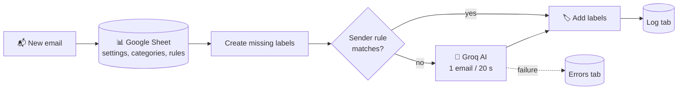

# Gmail Auto-Labeler

Labels every new Gmail email automatically. **Sender rules** handle predictable mail for free, a **free AI model** (Groq) handles the rest, and **all settings live in a Google Sheet** you can edit from your phone. Every labeled email and every error is logged back to that sheet.

  

<!-- Add a screenshot of the workflow canvas here: images/canvas.png -->

## What it does

- **Rules first.** GitHub, Jira, Slack, Teams, LinkedIn and security emails are labeled by sender with no AI call.
- **AI for the rest.** Unmatched emails go to Groq, which can apply several labels at once, plus ⭐ Starred and Important.
- **Creates labels for you.** Missing labels, including nested ones like `Dev/GitHub/PRs`, are created in Gmail automatically.
- **Handles each email once.** A hidden `n8n-p` label marks handled mail, so backlog runs always move forward.
- **Survives rate limits.** A failed AI call is logged and retried next run instead of stopping the batch.
- **Reports.** Instant email for sync or sheet problems, a daily summary at 20:00, and a crash alert via the error handler.

## What it never does

It never deletes, archives, moves to Spam or Trash, or removes labels. It only adds labels and marks emails Starred or Important.

## How it works

## Quick start

1. Get n8n running (Docker or your own server, e.g. `https://n8n.snova.com`) and a free Groq API key.
2. Upload `config/gmail-labeler-config.xlsx` to Google Drive and save it as a Google Sheet.
3. Import both files from `workflow/` into n8n.
4. Connect Gmail, Google Sheets and Groq credentials, and paste your sheet URL into the **Sheet URL** node.
5. Test with the manual trigger, then **Publish** both workflows.

**Full step-by-step guide with ✅ checkpoints: [SETUP.md](SETUP.md)** (about 45–60 minutes the first time).

## Files

| Path | What it is |
|---|---|
| `workflow/gmail-auto-labeler.json` | Main workflow (36 nodes) |
| `workflow/error-handler.json` | Crash alert + Errors-tab logging |
| `config/gmail-labeler-config.xlsx` | Google Sheet template with example categories and rules |
| `config/*.csv` | The same five tabs as CSV |
| `SETUP.md` | Complete setup guide |
| `CHANGELOG.md` | Version history |
| `images/` | Screenshots for the guide |

## Requirements

| | |
|---|---|
| n8n | 2.x (self-hosted or Cloud) |
| Accounts | Gmail, Google Sheets, Groq (free) |
| Credentials | Gmail OAuth2, Google Sheets OAuth2, Groq |
| Volume | Tuned for a personal inbox (under ~100 emails/day on Groq's free tier) |

## Customize without touching n8n

Everything below is done in the Google Sheet:

| To… | Do this |
|---|---|
| Add a label category | New row in **Categories** |
| Label a sender without AI | New row in **Rules** with `skip_ai = TRUE` |
| Let the AI star some of a sender's mail | Same rule with `skip_ai = FALSE` |
| Turn anything off | `active = FALSE` |
| Change who gets alerts | **Settings → alert_email** |

## Known limits

- **Free tier pacing.** One AI call every 20 seconds keeps you under Groq's per-minute token limit. Large backlogs take a while.
- **Always-on needed.** Scheduled runs only happen while n8n is running; missed runs are not caught up.
- **Google OAuth in Testing mode expires after about a week.** Publish your Google app (covered in SETUP.md).

## Write-up

The story behind the build, including the two bugs that stopped it labeling anything: [Medium article link]
