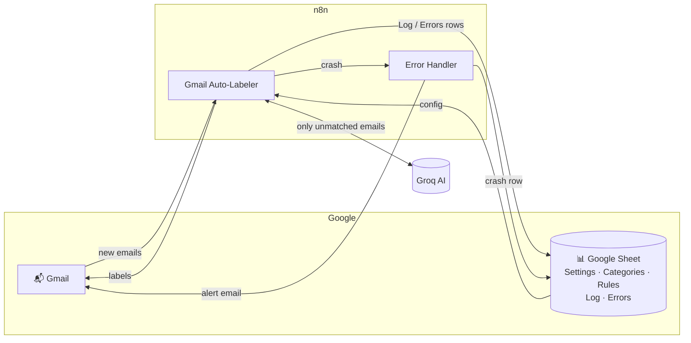
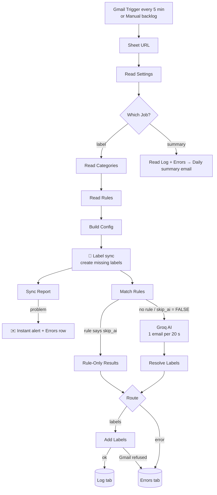
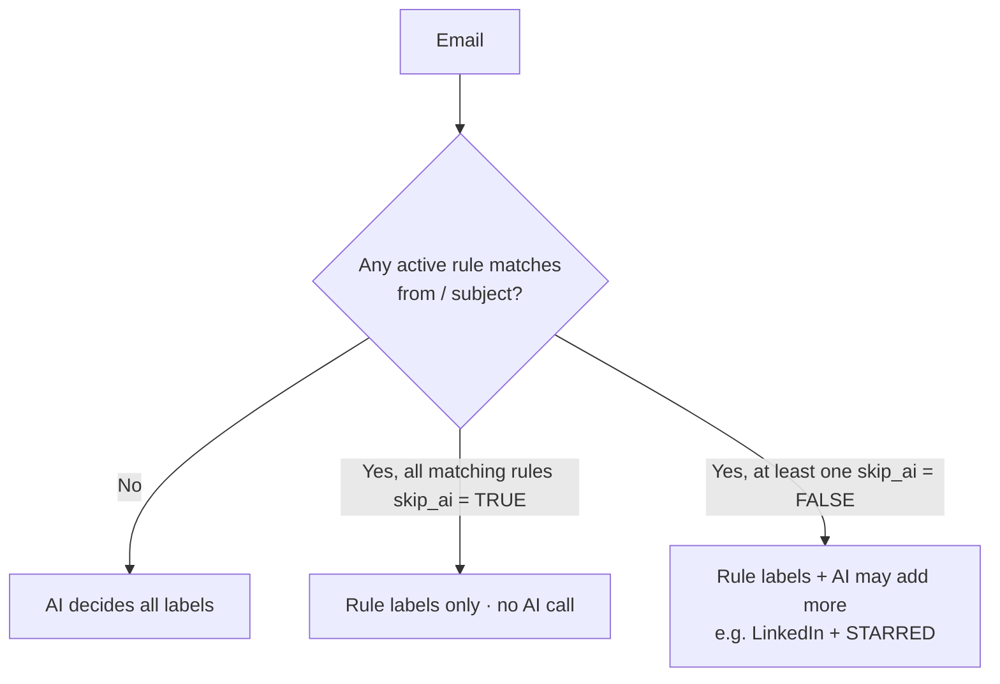
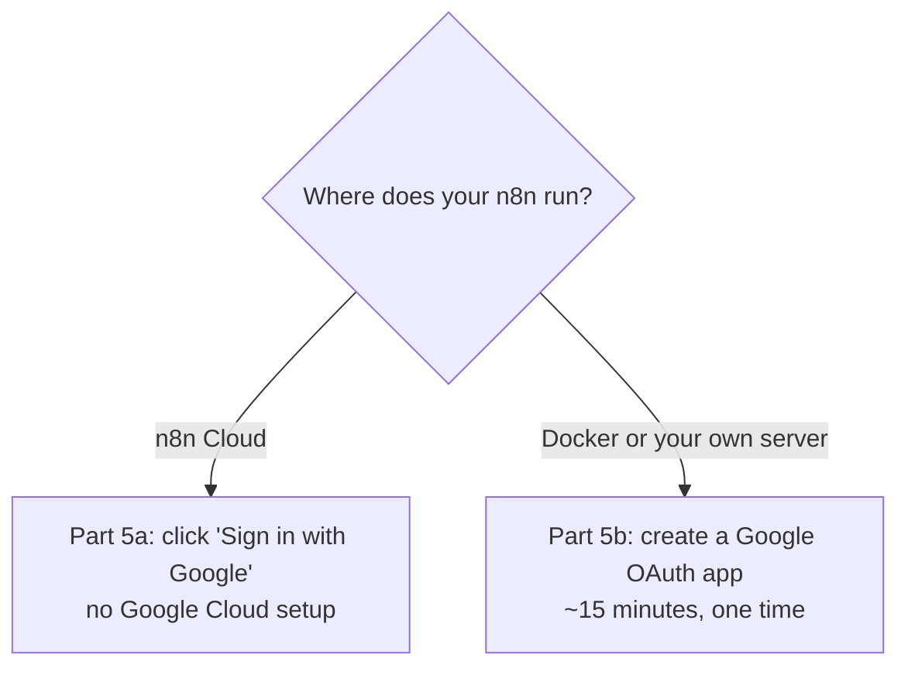
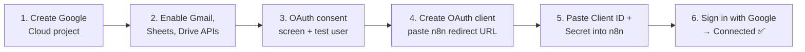
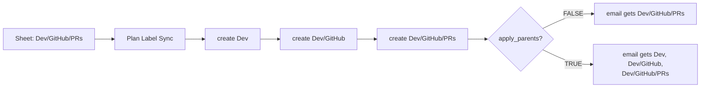

# Gmail Auto-Labeler — Complete Setup Guide

This guide takes you from nothing to a running workflow that labels your Gmail automatically. Sender **rules** handle predictable mail for free, a free **AI model** (Groq) handles the rest, and all settings live in a **Google Sheet** you can edit from your phone.

Written for beginners. Every step says where to click, and ✅ checkpoints tell you it worked. Budget about **45–60 minutes** the first time.

> **Placeholders used in this guide.** `https://n8n.snova.com` stands for *your* n8n address, and `you@example.com` for *your* email. Replace both wherever you see them.

## Contents

1. [How it works](#how-it-works)
2. [Before you start](#before-you-start)
3. Parts 1–10: n8n → Groq → Sheet → Import → Google → Credentials → Sheet URL → Timezone & errors → Test → Go live
4. [Managing it from the sheet](#managing-it-from-the-sheet-no-n8n-edits)
5. [Multi-level labels](#multi-level-labels)
6. [Troubleshooting](#troubleshooting)
7. [Final checklist](#final-checklist)

---

## How it works

### Overall



### Labeling pipeline



### Rule or AI?



### Where each kind of problem is reported

| Event | Errors tab | Instant email | Daily summary |
|---|---|---|---|
| Label created in Gmail | — | ✅ | — |
| Label could not be created | ✅ `label_create_failed` | ✅ (max once/day) | ✅ |
| Mistake in the sheet (bad field, empty label…) | ✅ `config` | ✅ (max once/day) | ✅ |
| Gmail label not used by any category/rule | — | ✅ (when the list changes) | — |
| AI call failed (e.g. rate limit) | ✅ `ai_error` | — | ✅ |
| AI returned a name not in Categories | ✅ `unknown_label` | — | ✅ |
| Gmail refused to add labels | ✅ `add_labels` | — | ✅ |
| Whole workflow crashed | ✅ `crash` | ✅ via Error Handler | ✅ |
| Email labeled successfully | **Log** tab | — | ✅ counts |

Emails that hit `ai_error` are **not** marked `n8n-p`, so the next run tries them again automatically.

---


## Before you start

| You need | Cost | Where |
|---|---|---|
| A Gmail account | Free | — |
| An n8n instance (Docker on your computer, your own server, or n8n Cloud) | Free self-hosted / paid Cloud | Part 1 |
| A Groq account and API key | Free tier, no card | Part 2 |
| A Google Sheet (from the template in `config/`) | Free | Part 3 |
| A Google Cloud project, **self-hosted n8n only** | Free | Part 5 |

**Files in this folder**

| File | What it is |
|---|---|
| `workflow/gmail-auto-labeler.json` | The labeler (36 nodes) |
| `workflow/error-handler.json` | Emails you and logs a row if the labeler crashes |
| `config/gmail-labeler-config.xlsx` | Google Sheet template: Settings, Categories, Rules, Log, Errors |
| `config/*.csv` | The same tabs as plain CSV, if you prefer to build the sheet by hand |



---

## Part 1: Get n8n running

> Skip this part if you already have n8n open in your browser.

### Option A: Docker on your computer (free, best for trying it)

1. Install **Docker Desktop** from docker.com and start it. Wait until it says Docker is running.
2. Open a terminal (Windows: PowerShell) and run these two commands exactly (they come from the official `n8n-io/n8n` README):

   ```bash
   docker volume create n8n_data
   docker run -it --rm --name n8n -p 5678:5678 -v n8n_data:/home/node/.n8n docker.n8n.io/n8nio/n8n
   ```

3. Wait until the terminal shows a line saying the editor is accessible, then open **http://localhost:5678** in your browser.
4. Create your owner account (email + password). This is local to your computer.

> ⚠️ **Important:** the workflow only runs while this Docker container is running. If you close the terminal or shut down your computer, emails won't be labeled until you start it again (re-run the `docker run` command — your workflows and credentials are kept in the `n8n_data` volume). For 24/7 labeling, run n8n on an always-on server (for example `https://n8n.snova.com`).

### Option B: Always-on server or n8n Cloud

Use your own server (in this guide: `https://n8n.snova.com` — replace it with your address everywhere you see it), or sign up for n8n Cloud at n8n.io (`https://<you>.app.n8n.cloud`).

✅ **You should now see:** the n8n home screen with a button to create a workflow.

---


## Part 2: Get a free Groq API key

1. Go to **https://console.groq.com** and sign in (Google, GitHub or email). No credit card needed for the free tier.
2. In the left menu click **API Keys** → **Create API Key**.
3. Name it `n8n-gmail-labeler` → **Submit**.
4. **Copy the key immediately** (starts with `gsk_`). Groq shows it only once. Paste it into a note temporarily.

> 🔒 Treat this key like a password. Never paste it into emails, screenshots or GitHub.

**Free tier limits:** Groq caps requests and tokens per minute and per day. Check your exact limits at console.groq.com → **Settings → Limits**. For a personal inbox this is plenty; it only matters when sorting a big backlog (Part 10).

✅ **You should now have:** a `gsk_...` key saved somewhere safe.

---


## Part 3: Create the Google Sheet

1. Go to **drive.google.com**, then click **＋ New → File upload** and select `config/gmail-labeler-config.xlsx` from this folder.
2. Double-click the uploaded file, then choose **Open with → Google Sheets** at the top.
3. Choose **File → Save as Google Sheets**. A new tab opens with a real Google Sheet.
4. Rename it (click the title) to `Gmail Labeler Config`. You can delete the uploaded `.xlsx` from Drive.
5. **Copy the full URL** from the address bar. It looks like `https://docs.google.com/spreadsheets/d/1AbC…xyz/edit#gid=0`.

✅ **You should now see** six tabs: **README, Settings, Categories, Rules, Log, Errors**. Categories has 15 example rows, Rules has 11, and Log and Errors have only headers. Edit the examples to match your own mail.

⚠️ Don't rename tabs or change the header cells in row 1. n8n finds them by name.

---


## Part 4: Import both workflows

1. If you already run another Gmail labeler, **unpublish** it first. Only one should run at a time.
2. Create a new workflow, then **⋯ → Import from File…** → `workflow/gmail-auto-labeler.json`, and save.
3. Create another new workflow, then **⋯ → Import from File…** → `workflow/error-handler.json`, and save.

✅ **You should now see** the labeler with a large yellow **Setup Notes** sticky, and a 4-node error handler.

---


## Part 5: Connect Google (Gmail + Sheets)

n8n needs permission to read your email, add labels and use your sheet. That's two credentials: **Gmail OAuth2 API** and **Google Sheets OAuth2 API**.

### 5a. n8n Cloud (easy path)

1. In the imported labeler, double-click **Gmail Trigger** → **Credential to connect with** → **Create new credential** → **Sign in with Google** → choose your account → **Allow** → **Save**. Rename it `Gmail account`.
2. Double-click **Read Settings** and do the same with **Google Sheets OAuth2 API**. Rename it `Google Sheets account`.
3. Skip to Part 6.

### 5b. Self-hosted: create your own Google OAuth app (one time, ~15 min)



**Step 1 — Create a project**

1. Go to **https://console.cloud.google.com** and sign in with the same Gmail account.
2. Click the **project dropdown** at the top → **New Project**.
3. Name: `n8n-gmail` → **Create**. Wait a few seconds, then make sure the top dropdown shows `n8n-gmail` selected.

**Step 2 — Enable three APIs**

1. Left menu → **APIs & Services → Library**.
2. Search `Gmail API` → click it → **Enable**.
3. Go back to **Library**, search `Google Sheets API` → **Enable**.
4. Go back to **Library**, search `Google Drive API` → **Enable**.

**Step 3 — Configure the OAuth consent screen**

1. Left menu → **APIs & Services → OAuth consent screen**. Google opens the **Google Auth Platform** overview.
2. Click **Get started**.
3. **App name:** `n8n Gmail Labeler` · **User support email:** your Gmail → **Next**.
4. **Audience:** choose **External** → **Next**. (Internal only exists for Google Workspace organizations.)
5. **Contact information:** your email → **Next**.
6. Accept the Google API Services User Data Policy → **Continue** → **Create**.
7. Left menu → **Audience** → under **Test users** click **Add users** → enter your Gmail address → **Save**.
   > Without this step you'll get "Access blocked / app not verified" later.
8. (Self-hosted on a public domain only) Left menu → **Branding** → **Authorized domains** → add your n8n domain → **Save**. If you run on `localhost`, skip this.

**Step 4 — Get the redirect URL from n8n (keep this tab open)**

1. In the imported labeler, double-click **Gmail Trigger** → **Credential to connect with** → **Create new credential** (type **Gmail OAuth2 API**).
2. Copy the **OAuth Redirect URL** shown at the top. It looks like:
   `http://localhost:5678/rest/oauth2-credential/callback` (Docker on your computer) or
   `https://n8n.snova.com/rest/oauth2-credential/callback` (server)

   > Google only accepts `http://` for `localhost`. A server needs `https://`.

**Step 5 — Create the OAuth client in Google**

1. Google Cloud → **APIs & Services → Credentials** → **＋ Create credentials → OAuth client ID**.
2. **Application type:** `Web application`. **Name:** `n8n`.
3. Under **Authorized redirect URIs** click **＋ Add URI** and paste the URL from Step 4 **exactly** (same `http`/`https`, same port).
4. Click **Create**. A popup shows your **Client ID** and **Client secret**.

**Step 6 — Finish in n8n**

1. Paste **Client ID** and **Client Secret** into the n8n credential form.
2. Click **Sign in with Google** → pick your account.
3. Google warns **"Google hasn't verified this app"** → click **Continue** (it's your own app). Tick all permission boxes → **Continue**.
4. Back in n8n you'll see **Account connected**. Click **Save**. Rename the credential to `Gmail account` so it's easy to find.
5. **Now the Sheets credential, with the same Client ID and Secret:** double-click **Read Settings** → **Credential to connect with** → **Create new credential** (type **Google Sheets OAuth2 API**) → paste the same Client ID and Client Secret → **Sign in with Google** → **Continue** → tick all boxes → **Save** → rename to `Google Sheets account`. The redirect URL is the same, so nothing changes in Google Cloud.

> ⚠️ **7-day expiry gotcha (self-hosted):** while your Google app is in **Testing** mode, Google expires the login after about 7 days and the workflow starts failing with auth errors. Fix: Google Auth Platform → **Audience** → **Publish app** → confirm. For a personal app you don't need Google verification; you'll just keep seeing the "unverified" warning when signing in. Alternatively, reconnect the credential weekly.

✅ **You should now have:** two credentials, `Gmail account` and `Google Sheets account`, both showing *Account connected*.

---


## Part 6: Attach credentials to every node

**Labeler**

| Credential | Nodes |
|---|---|
| Gmail account | Gmail Trigger, Get Inbox Backlog, Get Gmail Labels, Create Missing Label, Get Labels After Sync, Add Labels, Send Alert (Email), Send Daily Summary (8) |
| Google Sheets account | Read Settings, Read Categories, Read Rules, Read Log, Read Errors, Append Log, Append Errors (7) |
| Groq account | Groq Chat Model, with **Model** set to `openai/gpt-oss-20b` (1) |

**Error Handler:** Gmail account on **Send Crash Alert**, and Google Sheets account on **Log Crash to Errors Tab**. The crash alert recipient is pre-filled with your Gmail, so change **To** there if needed.

Open each node, pick the credential, and close it. Press **Ctrl+S**. ✅ No red warning icons should remain.

---


## Part 7: Paste your sheet URL (2 places)

| Workflow | Node | Where |
|---|---|---|
| Labeler | **Sheet URL** | Replace `PASTE_YOUR_GOOGLE_SHEET_URL_HERE` inside the quotes on the `const SHEET_URL = '…'` line |
| Error Handler | **Log Crash to Errors Tab** | **Document** field: replace the placeholder with your URL |

All other Sheets nodes in the labeler read the URL from the **Sheet URL** node, so you only paste it once there.

---


## Part 8: Timezone and error workflow

1. In the labeler, open **⋯ → Settings**.
2. Set **Timezone** to your own, e.g. `Asia/Kathmandu` or `Europe/London`. Without this, the Docker image's default timezone decides when "20:00" is, and your daily summary could arrive at the wrong hour.
3. Set **Error Workflow** to `Gmail Labeler — Error Handler`.
4. **Save**.

5. Open the **Error Handler** workflow and click **Publish**. n8n's own guidance is to publish every error workflow you reference; an unpublished one may never fire.

The error handler only runs for **published** (live) runs of the labeler, not manual test runs.

---


## Part 9: Test

### 8a. First run (sync and rules)
1. Send yourself two emails:
   - Subject `IELTS test date changed - please confirm`. The IELTS subject rule matches with skip_ai = FALSE, so the AI runs too.
   - Subject `Lunch tomorrow?`. No rule matches, so only the AI decides.
2. Click **Execute workflow** and choose **Manual Trigger (backlog)**. It processes up to 50 unprocessed inbox emails at about 20 s each, so a full batch takes around 17 minutes. For a quick test, first set **Get Inbox Backlog → Limit** to `5`.

| Where | You should see |
|---|---|
| Gmail sidebar | New labels **Dev** → GitHub, Jira, Slack, Teams, and **LinkedIn** (plus Security, Study Tracker, Service Updates if they were missing) |
| Your inbox | `[n8n labeler] Label sync: … created …` alert |
| **Log** tab | One row per labeled email, with `source` = `rule`, `ai` or `rule+ai` |
| **Errors** tab | Empty, or `ai_error` rows if Groq limited you (those emails are retried next run) |
| IELTS test email | IELTS label, probably ⭐ and Important |

### 8b. Rule-only test
Add a temporary row in **Rules**: `TRUE | subject | TEST-RULE | Projects | TRUE | test`. Send yourself an email with subject `TEST-RULE hello`, then run again.

✅ The email gets **Projects**, and its Log row shows `source = rule` with an empty `ai_answer`, meaning no AI call. Delete the test row afterwards.

### 8c. Sheet-mistake test
In **Rules**, change one `field` to `subjekt` and run.

✅ You get an instant alert "⚠️ Problems in your Google Sheet: Rules row X…" and a `config` row in **Errors**. Change it back afterwards.

### 8d. Daily summary test
Click **Execute workflow** and choose **Daily Summary Trigger**.

✅ You get `[n8n labeler] Daily summary: N labeled, M errors`.

### 8e. Crash alert test
Open the **Error Handler** and click **Execute workflow**. The Error Trigger uses built-in sample data when run manually.

✅ You get a "Workflow crashed: Example Workflow" email and a `crash` row in **Errors**.

---


## Part 10: Backlog and go live

1. Set **Get Inbox Backlog → Limit** back to `50`. Run the manual trigger until it finds no emails. Already-handled ones are skipped via the hidden `n8n-p` label.
2. Click **Publish** on the labeler.
3. Monitor in the labeler's **Executions** tab and in the **Log** and **Errors** tabs. The daily email arrives at 20:00.

---


## Managing it from the sheet (no n8n edits)

| I want to… | Do this in the sheet |
|---|---|
| Add a category | New row in **Categories**: `TRUE`, label name, description, `label`. The label is created in Gmail on the next run. |
| Label a sender without AI | New row in **Rules**: `TRUE`, `from`, part of the sender address, label(s), `TRUE` |
| Let the AI star some of a sender's emails | Same rule with `skip_ai` = `FALSE` |
| Put several labels on a rule | `labels` = `Dev/GitHub, STARRED` (comma-separated) |
| Turn something off temporarily | Set `active` = `FALSE` |
| Stop "unused label" alerts | **Settings → ignore_labels**, e.g. `Purchases, Old Stuff` |
| Change alert/summary address | **Settings → alert_email** |
| Limit labels the AI adds | **Settings → max_labels** (e.g. `3`) |
| Change summary time | n8n: **Daily Summary Trigger → Trigger at Hour** (the only setting outside the sheet) |

**Rule matching:** it isn't case-sensitive and checks "contains". `jira@` matches `jira@yourcompany.atlassian.net`. The `any` field checks sender and subject together.

**Tips for developers:**
- **Put every predictable sender in Rules.** Each rule removes AI calls for that sender entirely.
- **Watch the `ai` rows in the Log tab.** A sender that keeps appearing there should become a rule.
- **For Jira or GitHub, add subject rules to split things further.** For example, `subject | [PROD] | Dev/Alerts, IMPORTANT | TRUE`.

---

## Multi-level labels

Write the **full path with `/`** anywhere a label is used (Categories `label`, Rules `labels`, `ignore_labels`). Depth is unlimited, e.g. `Dev/GitHub/PRs`.



| Situation | What happens |
|---|---|
| Parent labels missing | Created automatically, parents first, so nesting shows correctly in Gmail |
| Extra spaces, e.g. `Dev / GitHub ` | Cleaned to `Dev/GitHub` |
| AI answers `PRs` instead of `Dev/GitHub/PRs` | Accepted if only one label ends in `PRs`; otherwise logged as `unknown_label` |
| You want the parent label to show all child emails | Set **Settings → apply_parents** to `TRUE`. By default Gmail's parent view shows only emails with that exact label. |
| Your own manual sub-labels under a listed label (e.g. `IT/Old`) | No "unused label" alert |
| You rename a parent in Gmail (e.g. `Dev` → `Work`) | Gmail renames all children too. **Update the sheet the same way**, or the workflow re-creates the old `Dev/...` labels and reports the new ones as unused. |

**Example rows for GitHub split by type:**

| active | field | contains | labels | skip_ai |
|---|---|---|---|---|
| TRUE | from | notifications@github.com | Dev/GitHub | TRUE |
| TRUE | subject | (PR # | Dev/GitHub/PRs | TRUE |
| TRUE | subject | Run failed | Dev/GitHub/CI, IMPORTANT | TRUE |

The rules add up: a PR email matches rows 1 and 2 and gets both labels. Delete row 1 if you only want the deepest label.

---


## Limits

| Service | Limit | Your usage (<100 emails/day) |
|---|---|---|
| Groq gpt-oss-20b (free) | 8,000 tokens/min, about 1,000 requests/day | Far below that, especially since rules skip many emails |
| Google Sheets API | Per-minute read/write quotas per user | About 5 reads + a few writes per run, so nowhere near them |
| AI pacing | 1 email every 20 s (set in **Choose Labels (AI) → Batch Processing**) | 50-email backlog runs take about 17 min |

---


## Troubleshooting

| Symptom | Cause | Fix |
|---|---|---|
| `redirect_uri_mismatch` when signing in with Google | Redirect URI in Google doesn't exactly match n8n's | Copy **OAuth Redirect URL** from the n8n credential again and paste it exactly (check `http` vs `https` and the port) |
| "Access blocked" / "app not verified" with no Continue button | Your Gmail isn't a test user | Google Auth Platform → **Audience** → **Test users** → add your address |
| Worked for a week, then auth errors | Testing-mode token expired | Publish the Google app (Part 5b, warning box) and reconnect both credentials |
| `Rate limit reached … tokens per minute` | Too many AI calls at once | Keep **Choose Labels (AI) → Batch Processing** at Batch Size 1 and Delay 20000; never turn on Retry On Fail for that node |
| "Sheet URL node: paste your Google Sheet link" | URL not pasted | Part 7 |
| `The resource you are requesting could not be found` on a Read node | Wrong URL, or a tab was renamed | Check the URL; tab names must be exactly Settings, Categories, Rules, Log, Errors |
| `403` / permission error on Sheets nodes | Sheets or Drive API not enabled, or the sheet belongs to another account | Part 5b, step 2; use the same Google account that owns the sheet |
| Log/Errors get an extra column | Header changed in row 1 | Restore the original headers |
| Daily summary at the wrong hour | Timezone not set | Part 8, step 2 |
| Crash email never arrives | Error workflow not selected or not published, or the crash happened in a manual run | Part 8; crash alerts only fire for published runs |
| Many `ai_error` rows | Groq rate limit | They retry automatically; add Rules for frequent senders; or raise **Delay Between Batches** to 30000 |
| Rule not matching | Text not actually in the sender/subject | Open the email, click the sender name to see the full address, and copy part of it exactly |
| Nested label shows as `Dev/GitHub` at top level | Parent created after child (older version) | Delete it in Gmail and run again; the workflow now creates parents first |
| Log row values empty | Item-matching issue (see "Not verified" at the top) | Tell me; I'll switch Build Log Row to a different method |
| Everything goes to AI | All rules `active = FALSE`, or `skip_ai = FALSE` | Check the Rules tab |

---

---

## Final checklist

- [ ] n8n running (localhost or `https://n8n.snova.com`)
- [ ] Groq API key saved as the **Groq** credential; model `openai/gpt-oss-20b`
- [ ] Google Sheet created from the template; URL copied
- [ ] Both workflows imported
- [ ] Gmail and Google Sheets credentials connected (Google app **published** if self-hosted)
- [ ] Credentials attached: 8 Gmail, 7 Sheets, 1 Groq (labeler); 1 Gmail, 1 Sheets (error handler)
- [ ] Sheet URL pasted in **Sheet URL** and **Log Crash to Errors Tab**
- [ ] Timezone set; Error Workflow selected; **error handler published**
- [ ] `alert_email` set in the Settings tab; crash recipient set in **Send Crash Alert**
- [ ] Tests passed; backlog cleared; labeler **Published**
